# KafkaStream

## GitHub Repository Path

[(https://github.com/Andrey-Vospr/M12_Kafka_Stream)](https://github.com/Andrey-Vospr/M12_Kafka_Stream)

---
## 1. Prepare Azure account to work with task

Run the following command to authenticate:

```bash
wsl -d Ubuntu
az login
```

## 2. Update Terraform Configuration


```

- **Edit the backend block in `main.tf` :**

```hcl
terraform {
  backend "azurerm" {
    resource_group_name  = "K12kafkastream"
    storage_account_name = "m12kafkastorageaccount" # Provide Storage Account name, where Terraform Remote state is stored
    container_name       = "result"
    key                  = "terraform.tfstate"
  }
```  

## 3. Deploy Infrastructure with Terraform


Run the following Terraform commands:

```bash
terraform init
terraform plan -out terraform.plan
terraform apply terraform.plan
terraform output resource_group_name
az resource list --resource-group rg-dev-westeurope-efen --output table
```

<p align="center">
  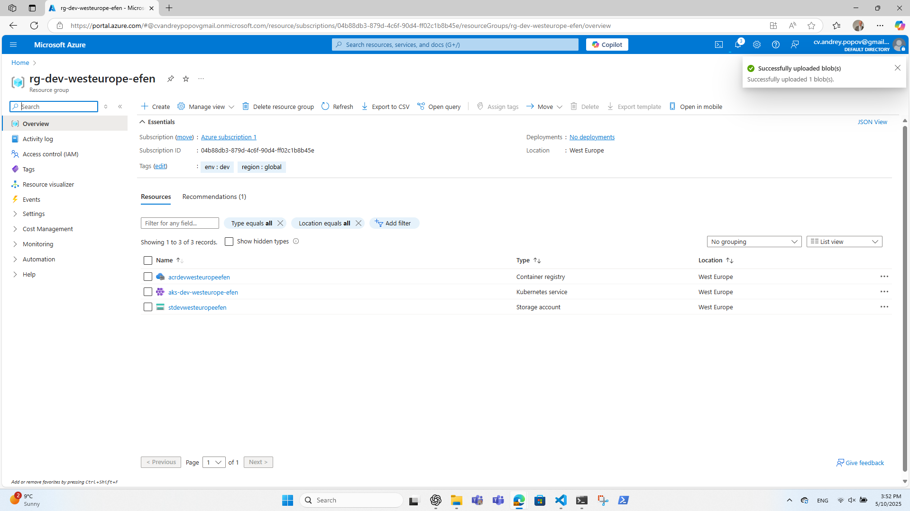
</p>

## 4. Retrieve kubeconfig.yaml and Set It as Default

4.1 Extract `kubeconfig.yaml` from the directory `/terraform`:

```bash
terraform output -raw aks_name
```
4.2 Set `kubeconfig.yaml` as Default for kubectl

4.3 Switch to the project kubernetes namespace:

```bash
kubectl config set-context --current --namespace confluent
```
Verify Kubernetes Cluster Connectivity:

```bash
kubectl get nodes
```
4.4 Install Confluent for Kubernetes

- Add the Confluent for Kubernetes Helm repository:

```bash
helm repo add confluentinc https://packages.confluent.io/helm
helm repo update
 ```
Update Complete. ⎈Happy Helming!⎈

4.5 Install Confluent for Kubernetes:

```bash
helm upgrade --install confluent-operator confluentinc/confluent-for-kubernetes
```

## 5. Configure and Use Azure Container Registry (ACR)

Azure Container Registry (ACR) is used to store container images before deploying them to AKS.

5.1 Get the `<ACR_NAME>` run the following command:

```bash
terraform output acr_login_server
```
"acrdevwesteuropeefen.azurecr.io"

## 6. Build and push `azure-connector` into ACR

6.1 Build the Docker image: 

```bash
docker build -t acrdevwesteuropeefen.azurecr.io/azure-connector:latest .
```
6.2 Push Docker Image to ACR:

```bash
docker push acrdevwesteuropeefen.azurecr.io/azure-connector
```
6.3 Result
---------------
    azure-connector

## 7.  Install Confluent Platform

7.1 Go into `root` folder. Modify the file `confluent-platform.yaml` and replace the placeholder with actual value:

```yaml
    image:
    ⦙ application: acrdevwesteuropeefen.azurecr.io/azure-connector:latest
    ⦙ init: confluentinc/confluent-init-container:2.10.0
    dependencies:
```

## 8.  Install all Confluent Platform components:

```bash
kubectl apply -f confluent-platform.yaml
```
<p align="center">
  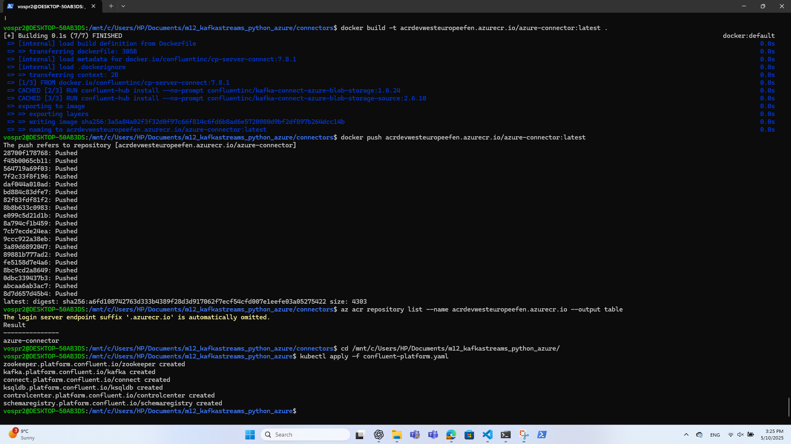
</p>

## 9.  Install a sample producer app and topic:

```bash
kubectl apply -f producer-app-data.yaml
kubectl get pods -o wide 
```
<p align="center">
  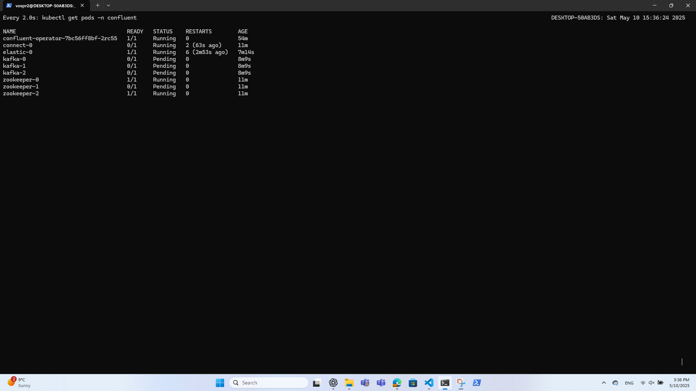
</p>

## 10. Create a kafka topic

10.1 The topic should have at least 3 partitions because the azure blob storage has 3 partitions. Name the new topic: `expedia`.

10.2  Create a connection for kafka:

```bash
kubectl port-forward connect-0 8083:8083 &>/dev/null &
```

10.3 execute below command to create Kafka topic with a name 'expedia'

```bash
kubectl exec kafka-0 -c kafka -- bash -c "/usr/bin/kafka-topics --create --topic expedia --replication-factor 3 --partitions 3 --bootstrap-server kafka:9092"
```

## 11. Upload the data files into Azure Containers

<p align="center">
  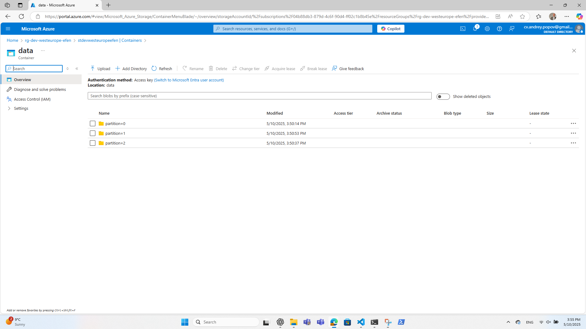
</p>

## 12. Verify the messages in Kafka

```bash
kubectl port-forward controlcenter-0 9021:9021
```

12.1 Browse to Control Center: [http://localhost:9021](http://localhost:9021)

<p align="center">
  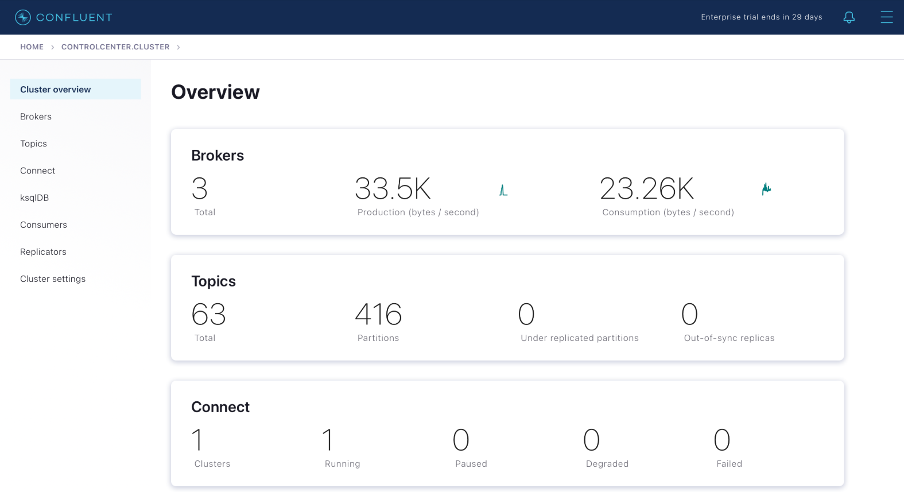
</p>

12.2 Create a connection for kafka:
```bash
kubectl port-forward connect-0 8083:8083 &>/dev/null &
```
<p align="center">
  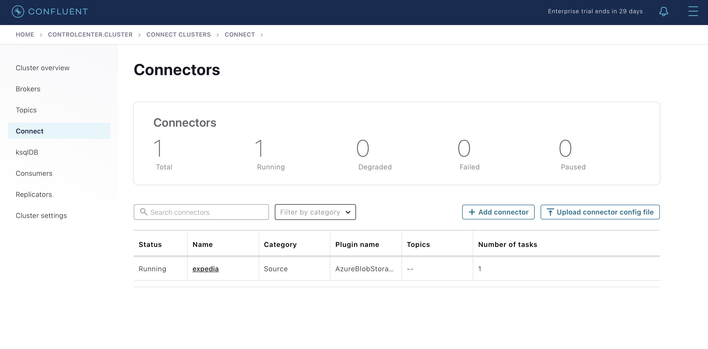
</p>

12.3  Go into Cluster => Topics 

<p align="center">
  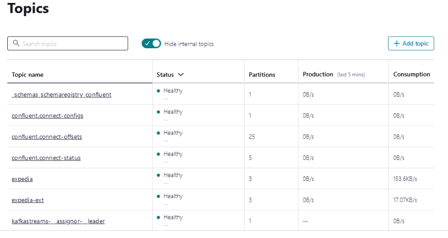
</p>

12.4 Create Kafka topics expedia and expedia-ext:
```bash
kubectl exec kafka-0 -c kafka -- bash -c "/usr/bin/kafka-topics --create --topic <topic name> --replication-factor 3 --partitions 3 --bootstrap-server localhost:9092" 
``` 

12.5 Choose your topic name "expedia"

<p align="center">
  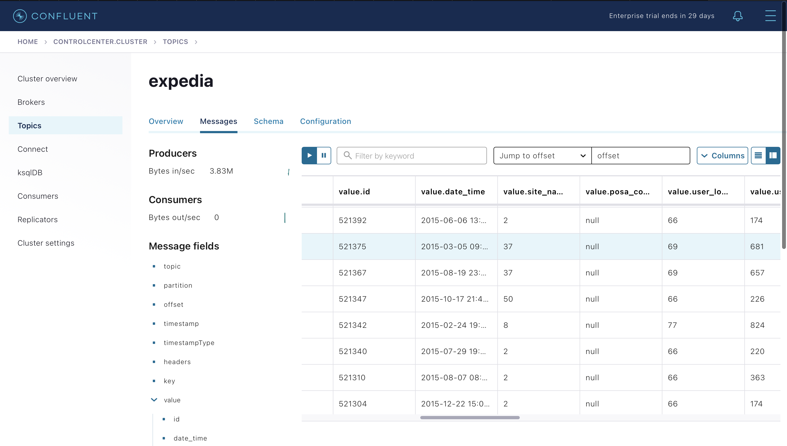
</p>

12.6 and expedia-ext:
<p align="center">
  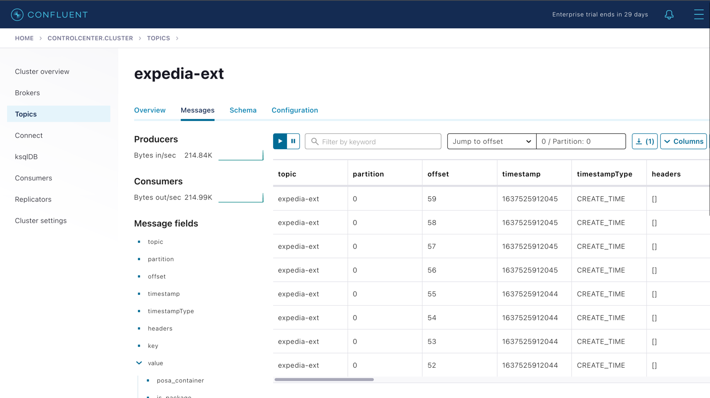
</p>

- In the `messages` tab you should able to see incoming messages
<p align="center">
  
</p>


## 13. Create an output kafka topic

13.1 Create topic with 3 partitions because the topic `expedia` has 3 partitions. Name the new topic: `expedia_ext`:

```bash
kubectl exec kafka-0 -c kafka -- bash -c "/usr/bin/kafka-topics --create --topic expedia_ext --replication-factor 3 --partitions 3 --bootstrap-server kafka:9092"
```

## 14. Deploy Stream application

14.1 Build and Push the Docker image: 

```bash
docker build -t acrdevwesteuropeefen.azurecr.io/stream-app:latest .
docker push acrdevwesteuropeefen.azurecr.io/stream-app:latest
```

## 15. Deploy Stream Application into AKS

15.1 modify the file `stream-app.yaml` (change the placeholder):

```yaml
    13   ⦙ ⦙ ⦙ app: kstream-app
    14   ⦙ spec:
    15   ⦙ ⦙ containers:
    16   ⦙ ⦙ ⦙ - name: kstream-app
    17   ⦙ ⦙ ⦙ ⦙ image: acrdevwesteuropeefen.azurecr.io/stream-app:latest
```

## 16. Deploy stream application by command:

```bash
kubectl apply -f stream-app.yaml
```

## 17.Visualize Data from Kafka Topic `expedia_ext` with KSQL

17.1 Start by running the following command to access the KSQL command prompt:

```bash
kubectl --kubeconfig=kubeconfig exec --stdin --tty $(kubectl --kubeconfig=kubeconfig get pods -o name | grep 'ksqldb-cli') -- ksql http://ksqldb.confluent.svc.cluster.local:8088
```
<p align="center">
  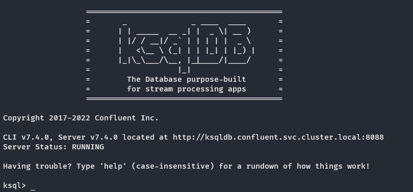
</p>

17.2 Create a stream from `expedia_ext` topic
```sql
    CREATE STREAM hotelstream (
        id BIGINT,
        hotel_id BIGINT,
        stay_category VARCHAR
    ) WITH (
        kafka_topic = 'expedia-ext', key_format = 'kafka', value_format = 'json', partitions = 3, 
        replicas = 1
    );
```
17.3 Now create an aggregating table to count all hotels:

```sql
    CREATE TABLE all_hotels_count AS
    SELECT 1, count_distinct(hotel_id) AS hotels_count
    FROM hotelstream
    GROUP BY 1;
```

<p align="center">
  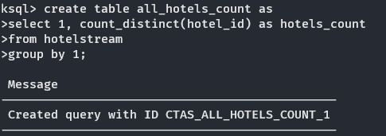
</p>

17.4 Query its contents:

```sql
    SELECT hotels_count FROM all_hotels_count;
```

<p align="center">
  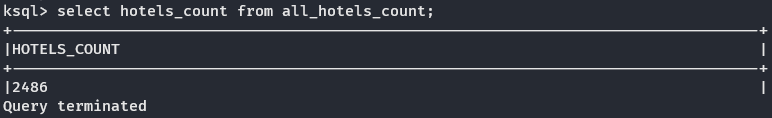
</p>

17.5 Aggregate hotels by the category of stay:
```sql
    CREATE TABLE stays_hotels_count AS 
    SELECT stay_category, count_distinct(hotel_id) AS hotels_count
    FROM hotelstream
    GROUP BY stay_category;
```
<p align="center">
  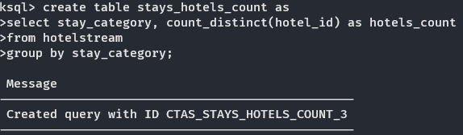
</p>

17.6 And, when this table is filled, query its contents:
```sql
    SELECT * FROM stays_hotels_count;
```
<p align="center">
  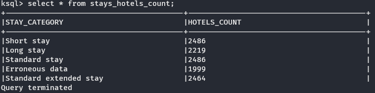
</p>

17.7 This will return a table with results - "Show total amount of hotels (hotel_id) and number of distinct hotels (hotel_id) for each category":

```sql
    SELECT * FROM EXPEDIA_TABLE 
    WHERE CATEGORY IN 
        ('Short stay', 'Standard stay', 'Standard extended stay', 'Long stay',     'Erroneous data'); 
```
## Table with total amount of hotels (hotel_id)/ number of distinct hotels (hotel_id) for each category:

```
             +----------------------------+------------------+----------------+ 
            |CATEGORY                    |TOTAL_HOTELS      |DISTINCT_HOTELS | 
            +----------------------------+------------------+----------------+ 
            |Short stay                  |1065918           |2486            | 
            |Standard stay               |252741            |2486            | 
            |Long stay                   |5924              |2247            | 
            |Standard extended stay      |13746             |2464            | 
            |Erroneous data              |4019              |1994            | 

 ```

## 18. Destroy Infrastructure 

```bash
kubectl delete -f producer-app-data.yaml
kubectl delete -f confluent-platform.yaml
helm uninstall confluent-operator
terraform destroy
```
